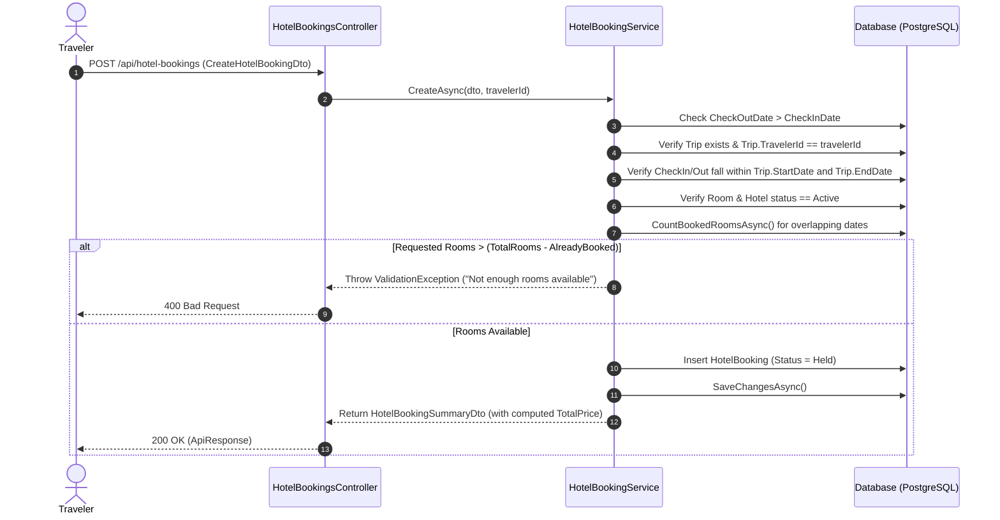
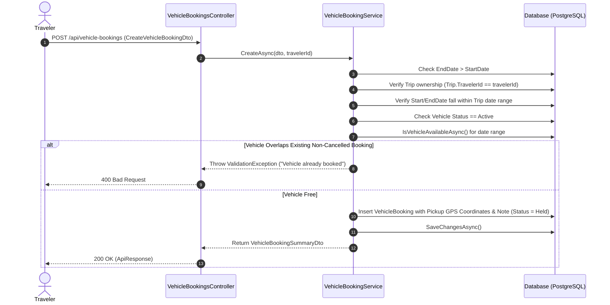
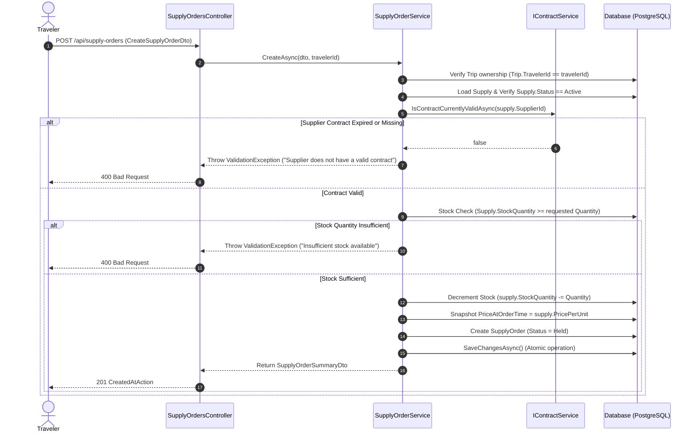
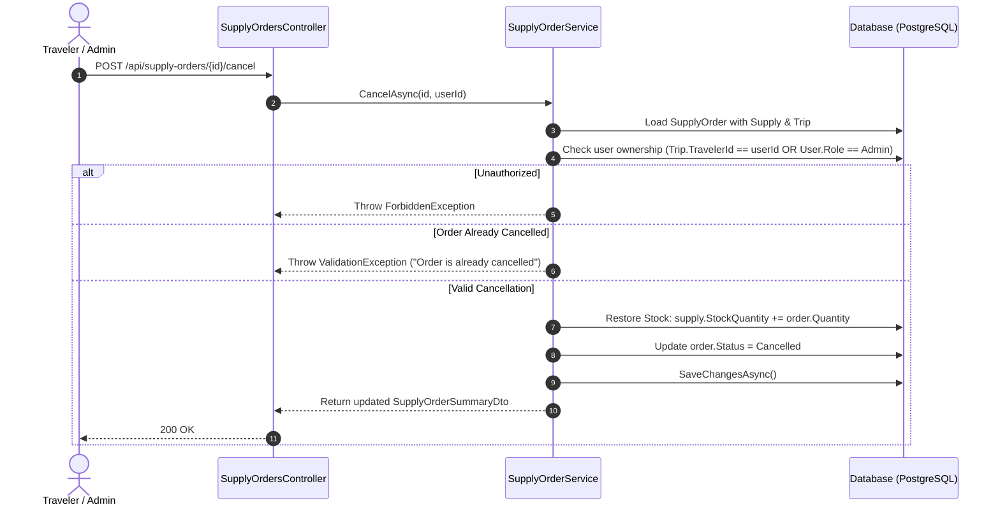

# Booking Systems Technical Specification
**Domains:** Hotel Bookings, Vehicle Bookings, & Supply Orders  
**Target:** API Architecture, Endpoints, DTO Schemas, Business Workflows, & Design Decisions  

---

## 1. Architectural Principles & Design Decisions

### 1.1 Why There Are NO HTTP `DELETE` Endpoints
In standard REST APIs, developers often expect `DELETE /api/resource/{id}` endpoints. However, in this system, **HTTP DELETE endpoints are deliberately omitted** for all three booking subsystems (Hotel Bookings, Vehicle Bookings, Supply Orders).

This design decision is governed by the following core domain rules:

1. **Financial & Historical Audit Trails:**  
   Bookings and orders carry transactional, legal, and financial records. Deleting a record permanently from the database destroys historical metrics (e.g., total spent by a traveler, total revenues of a hotel/supplier, past trip itineraries) and invalidates audited records.
   
2. **Referential Integrity & Cascade Safety:**  
   Bookings act as foreign-key anchors linking `Trips`, `Users` (Travelers, Suppliers), `Rooms`, `Vehicles`, and `Supplies`. Hard-deleting rows risks cascading deletes across foreign keys or leaving orphaned relationships.

3. **Domain Recovery Operations (Inventory & Stock Restoration):**  
   Cancellation is a business operation, not a database removal. When a booking or order is cancelled:
   - **Supply Orders:** The system automatically restores the ordered item count back to the supply's `StockQuantity`.
   - **Hotel & Vehicle Bookings:** The system changes the status, immediately releasing the room/vehicle availability for overlapping date searches.
   
4. **State Machine Workflow (`BookingStatus`):**  
   Instead of physical deletion, all booking entities follow an explicit state machine:
   - `Held`: Tentative reservation made upon initial creation (reserves room/vehicle/stock).
   - `Confirmed`: Payment/contract finalized (future enhancement / active state).
   - `Cancelled`: Booking cancelled by Traveler or Admin. Remains permanently in the DB with status `Cancelled` for history and auditing.

---

## 2. Shared Response Wrappers & Enums

### 2.1 BookingStatus Enum (`Models/BookingStatus.cs`)
```csharp
public enum BookingStatus
{
    Held,       // Tentative reservation — reserves availability/stock
    Confirmed,  // Finalized booking
    Cancelled   // Inactive; retained in database for historical auditing
}
```

### 2.2 Standard API Response Envelopes
All endpoints wrap payload data in standard response objects:

**Single Resource (`ApiResponse<T>`):**
```json
{
  "success": true,
  "message": "Hotel booking created (Held).",
  "data": { ... },
  "errors": null
}
```

**Paged Collection (`ApiResponse<PagedResult<T>>`):**
```json
{
  "success": true,
  "message": "Success",
  "data": {
    "items": [ ... ],
    "totalCount": 42,
    "page": 1,
    "pageSize": 20,
    "totalPages": 3,
    "hasPreviousPage": false,
    "hasNextPage": true
  },
  "errors": null
}
```

---

## 3. Hotel Bookings Subsystem

### 3.1 Endpoints (`Controllers/HotelBookingsController.cs`)
Base Route: `/api/hotel-bookings`

| HTTP Method | Path | Allowed Roles | Description |
|---|---|---|---|
| `POST` | `/api/hotel-bookings` | `Traveler` | Creates a new hotel booking for a trip. Initial status is `Held`. |
| `GET` | `/api/hotel-bookings/my` | `Traveler` | Retrieves paginated hotel bookings for the authenticated traveler's trips. Optional `?status=` filter. |
| `POST` | `/api/hotel-bookings/{id}/cancel` | `Traveler`, `Admin`, `SuperAdmin` | Cancels a hotel booking. Updates status to `Cancelled`. |

### 3.2 Business Logic & Workflow (`Services/Implementations/HotelBookingService.cs`)



#### Key Validations & Calculations:
1. **Date Bounds:** `CheckOutDate` must be strictly after `CheckInDate`.
2. **Trip Ownership & Timeline:** Trip must exist, belong to the authenticated traveler, and booking dates must fall inside `[Trip.StartDate, Trip.EndDate]`.
3. **Entity Status:** Both the `Room` and parent `Hotel` must have `Status == Active`.
4. **Capacity Check:** Computes already booked rooms during overlapping date range:
   $$\text{Available Rooms} = \text{Room.TotalRooms} - \text{CountBookedRooms}(checkIn, checkOut)$$
   Throws exception if `NumberOfRooms > Available`.
5. **Price Computation:** Total price is computed dynamically during DTO mapping (not stored directly in DB):
   $$\text{TotalPrice} = \text{Room.PricePerNight} \times (\text{CheckOutDate} - \text{CheckInDate}).\text{Days} \times \text{NumberOfRooms}$$

---

### 3.3 DTO Schemas & JSON Examples

#### Request DTO: `CreateHotelBookingDto`
```csharp
public class CreateHotelBookingDto
{
    [Required]
    public int TripId { get; set; }

    [Required]
    public int RoomId { get; set; }

    [Required]
    public DateTime CheckInDate { get; set; }

    [Required]
    public DateTime CheckOutDate { get; set; }

    [Required]
    [Range(1, int.MaxValue, ErrorMessage = "NumberOfRooms must be at least 1.")]
    public int NumberOfRooms { get; set; }
}
```

*Example Request JSON:*
```json
{
  "tripId": 12,
  "roomId": 5,
  "checkInDate": "2026-10-10T14:00:00Z",
  "checkOutDate": "2026-10-14T10:00:00Z",
  "numberOfRooms": 2
}
```

#### Response DTO: `HotelBookingSummaryDto`
```csharp
public class HotelBookingSummaryDto
{
    public int Id { get; set; }
    public string HotelName { get; set; } = string.Empty;
    public string RoomType { get; set; } = string.Empty;
    public DateTime CheckInDate { get; set; }
    public DateTime CheckOutDate { get; set; }
    public int NumberOfRooms { get; set; }
    public BookingStatus Status { get; set; }
    public decimal TotalPrice { get; set; }
}
```

*Example Response JSON:*
```json
{
  "id": 101,
  "hotelName": "Grand Palace Hotel",
  "roomType": "Deluxe Sea View Suite",
  "checkInDate": "2026-10-10T14:00:00Z",
  "checkOutDate": "2026-10-14T10:00:00Z",
  "numberOfRooms": 2,
  "status": "Held",
  "totalPrice": 1200.00
}
```

---

## 4. Vehicle Bookings Subsystem

### 4.1 Endpoints (`Controllers/VehicleBookingsController.cs`)
Base Route: `/api/vehicle-bookings`

| HTTP Method | Path | Allowed Roles | Description |
|---|---|---|---|
| `POST` | `/api/vehicle-bookings` | `Traveler` | Creates a new vehicle booking. Initial status is `Held`. |
| `GET` | `/api/vehicle-bookings/my` | `Traveler` | Retrieves paginated vehicle bookings for the logged-in traveler. |
| `POST` | `/api/vehicle-bookings/{id}/cancel` | `Traveler`, `Admin`, `SuperAdmin` | Cancels a vehicle booking. Updates status to `Cancelled`. |
| `GET` | `/api/vehicle-bookings` | `Admin`, `SuperAdmin` | Administrative oversight listing of all vehicle bookings across the platform. |

---

### 4.2 Business Logic & Workflow (`Services/Implementations/VehicleBookingService.cs`)



#### Key Validations & Calculations:
1. **Date Validation:** `EndDate` must be after `StartDate`.
2. **Trip Ownership & Schedule Containment:** Booking dates must fall strictly inside `[Trip.StartDate, Trip.EndDate]`.
3. **Vehicle Availability Check:** Uses `IsVehicleAvailableAsync(vehicleId, startDate, endDate)` to check if the specific physical vehicle has any active (`Held` or `Confirmed`) overlapping bookings.
4. **Geolocation Pickup Capture:** Stores precise latitude/longitude (`PickupLatitude`, `PickupLongitude`) for delivery along with optional instructions (`PickupNote`).
5. **Price Computation:** Calculated dynamically in mapping:
   $$\text{TotalPrice} = \text{Vehicle.PricePerDay} \times (\text{EndDate} - \text{StartDate}).\text{Days}$$

---

### 4.3 DTO Schemas & JSON Examples

#### Request DTO: `CreateVehicleBookingDto`
```csharp
public class CreateVehicleBookingDto
{
    [Required]
    public int TripId { get; set; }

    [Required]
    public int VehicleId { get; set; }

    [Required]
    public DateTime StartDate { get; set; }

    [Required]
    public DateTime EndDate { get; set; }

    [Required]
    [Range(-90.0, 90.0, ErrorMessage = "PickupLatitude must be between -90 and 90.")]
    public decimal PickupLatitude { get; set; }

    [Required]
    [Range(-180.0, 180.0, ErrorMessage = "PickupLongitude must be between -180 and 180.")]
    public decimal PickupLongitude { get; set; }

    public string? PickupNote { get; set; }
}
```

*Example Request JSON:*
```json
{
  "tripId": 12,
  "vehicleId": 3,
  "startDate": "2026-10-11T09:00:00Z",
  "endDate": "2026-10-13T18:00:00Z",
  "pickupLatitude": 6.927079,
  "pickupLongitude": 79.861244,
  "pickupNote": "Deliver near airport terminal gate 2"
}
```

#### Response DTO: `VehicleBookingSummaryDto`
```csharp
public class VehicleBookingSummaryDto
{
    public int Id { get; set; }
    public string VehicleType { get; set; } = string.Empty;
    public string Model { get; set; } = string.Empty;
    public string RegistrationNumber { get; set; } = string.Empty;
    public DateTime StartDate { get; set; }
    public DateTime EndDate { get; set; }
    public decimal PickupLatitude { get; set; }
    public decimal PickupLongitude { get; set; }
    public string? PickupNote { get; set; }
    public BookingStatus Status { get; set; }
    public decimal TotalPrice { get; set; }
}
```

*Example Response JSON:*
```json
{
  "id": 55,
  "vehicleType": "SUV",
  "model": "Toyota Prado 2024",
  "registrationNumber": "CAB-8899",
  "startDate": "2026-10-11T09:00:00Z",
  "endDate": "2026-10-13T18:00:00Z",
  "pickupLatitude": 6.927079,
  "pickupLongitude": 79.861244,
  "pickupNote": "Deliver near airport terminal gate 2",
  "status": "Held",
  "totalPrice": 450.00
}
```

---

## 5. Supply Orders Subsystem

### 5.1 Endpoints (`Controllers/SupplyOrdersController.cs`)
Base Route: `/api/supply-orders`

| HTTP Method | Path | Allowed Roles | Description |
|---|---|---|---|
| `POST` | `/api/supply-orders` | `Traveler` | Places a supply order for a trip. Atomic stock deduction occurs. Initial status `Held`. |
| `GET` | `/api/supply-orders/my` | `Traveler` | Gets supply orders placed by the authenticated traveler. Supports `status`, `sort`, pagination. |
| `POST` | `/api/supply-orders/{id}/cancel` | `Traveler`, `Admin`, `SuperAdmin` | Cancels a supply order and **restores inventory stock**. |
| `GET` | `/api/supply-orders/received` | `Supplier` | Lists supply orders placed for items belonging to the authenticated supplier. |
| `GET` | `/api/supply-orders` | `Admin`, `SuperAdmin` | Admin oversight list of all supply orders platform-wide. |

---

### 5.2 Business Logic & Workflow (`Services/Implementations/SupplyOrderService.cs`)



#### Cancellation & Stock Recovery Workflow:


#### Key Validations & Characteristics:
1. **Trip Ownership:** Only the owner of the referenced Trip can place or cancel the order.
2. **Contract Validity Enforced:** Checks supplier contract validity live using `IContractService.IsContractCurrentlyValidAsync(supply.SupplierId)`.
3. **Atomic Stock Decrement:** Stock is deducted immediately upon order placement (`StockQuantity -= dto.Quantity`).
4. **Historical Price Snapshot (`PriceAtOrderTime`):** Stores the exact price of the item at the exact second the order was placed. If the supplier changes `PricePerUnit` later, existing order financial figures remain unchanged.
5. **Stock Recovery on Cancellation:** Cancelling an order automatically adds `Quantity` back into the supply's `StockQuantity`.
6. **Price Computation:**
   $$\text{TotalPrice} = \text{PriceAtOrderTime} \times \text{Quantity}$$

---

### 5.3 DTO Schemas & JSON Examples

#### Request DTO: `CreateSupplyOrderDto`
```csharp
public class CreateSupplyOrderDto
{
    [Required]
    public int TripId { get; set; }

    [Required]
    public int SupplyId { get; set; }

    [Required]
    [Range(1, int.MaxValue, ErrorMessage = "Quantity must be at least 1.")]
    public int Quantity { get; set; }
}
```

*Example Request JSON:*
```json
{
  "tripId": 12,
  "supplyId": 8,
  "quantity": 3
}
```

#### Response DTO: `SupplyOrderSummaryDto`
```csharp
public class SupplyOrderSummaryDto
{
    public int Id { get; set; }
    public string SupplyName { get; set; } = string.Empty;
    public int Quantity { get; set; }
    public decimal PriceAtOrderTime { get; set; }
    public decimal TotalPrice { get; set; }
    public BookingStatus Status { get; set; }
}
```

*Example Response JSON:*
```json
{
  "id": 78,
  "supplyName": "Camping Tent (4-Person)",
  "quantity": 3,
  "priceAtOrderTime": 45.00,
  "totalPrice": 135.00,
  "status": "Held"
}
```

---

## 6. Summary Comparison Matrix

| Feature / Domain | Hotel Bookings | Vehicle Bookings | Supply Orders |
|---|---|---|---|
| **Base Route** | `/api/hotel-bookings` | `/api/vehicle-bookings` | `/api/supply-orders` |
| **Creation Endpoint** | `POST /` | `POST /` | `POST /` |
| **Cancellation Endpoint** | `POST /{id}/cancel` | `POST /{id}/cancel` | `POST /{id}/cancel` |
| **HTTP Delete Endpoint** | ❌ None (By Design) | ❌ None (By Design) | ❌ None (By Design) |
| **Initial Status** | `Held` | `Held` | `Held` |
| **Availability Mechanism** | Overlap check against `Room.TotalRooms` | Overlap check per specific physical vehicle | Inventory check against `Supply.StockQuantity` |
| **Contract Validation** | Checks Hotel & Room active status | Checks Vehicle active status | Verifies active supplier contract via `IContractService` |
| **Price Rule** | `PricePerNight * Nights * Rooms` | `PricePerDay * Days` | `PriceAtOrderTime * Quantity` (Snapshot) |
| **Stock/Inventory Action on Cancel** | Releases room availability | Releases vehicle availability | Restores `StockQuantity += Quantity` |

---

## 7. Instructions for Secondary AI Integration

If uploading this specification to another LLM/AI model, present the following context:

> *"This document describes the three booking modules of our Tour Management System (.NET 9 Web API + EF Core + PostgreSQL). All three modules share a unified `BookingStatus` lifecycle (`Held`, `Confirmed`, `Cancelled`) and use `POST /{id}/cancel` instead of `DELETE` to maintain referential integrity, financial audit trails, and inventory restoration logic. Use these endpoint definitions, DTO structures, and workflow rules when prompting for frontend component integration, unit test creation, or API client generation."*
